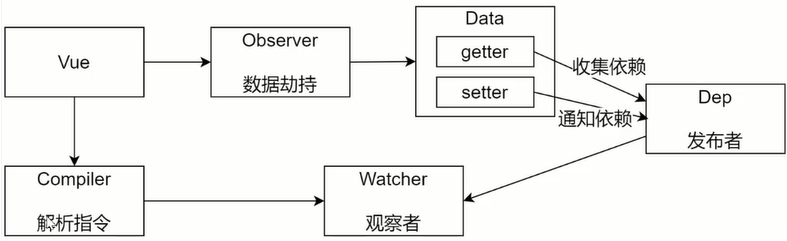

# 手撕Vue源码：Vue的响应式原理分析

## 一. 培训目标

- 实现一个最小版本的Vue
- 了解在使用Vue过程中，在响应式原理层面的遇到的问题原因及其解决方法

## 二. 基础概念

### 1. 数据驱动

​	数据驱动就是在开发过程中仅需要关注数据本身，不需要关心数据是如何渲染到视图。其主要表现就是数据响应式和双向绑定。

#### 数据响应式

​	数据响应式中的数据指的是数据模型，我们基于Vue开发时，数据模型就是个普通的JavaScript对象。数据响应式的核心概念是当我们修改对象中的数据时，视图会进行更新，避免了繁琐的DOM操作，提高了开发效率。

#### 双向绑定

​	双向绑定的核心概念指的是数据改变时，视图改变；视图改变时，数据也随之改变。

​	我们可以使用v-model在表单元素上创建双向数据绑定

### 2. 响应式的核心原理

​	Vue 2.x实现数据响应式是通过Object.defineProperty,Vue 3.x实现数据响应式是通过Proxy。今天我们主要了解Vue 2.x，即通过Object.defineProperty实现响应式原理

```js
// 模拟 Vue 中的 data 选项
let data = {
	msg: 'hello'
}
// 模拟 Vue 的实例
let vm = {}
// 数据劫持：当访问或者设置 vm 中的成员的时候，做一些干预操作
Object.defineProperty(vm, 'msg', {
    // 可枚举（可遍历）
    enumerable: true,
    // 可配置（可以使用 delete 删除，可以通过 defineProperty 重新定义）
    configurable: true,
    // 当获取值的时候执行
    get () {
        console.log('get: ', data.msg)
        return data.msg
    },
    // 当设置值的时候执行
    set (newValue) {
        console.log('set: ', newValue)
        if (newValue === data.msg) {
                return
        }
        data.msg = newValue
        // 数据更改，更新 DOM 的值
        document.querySelector('#app').textContent = data.msg
    }
})
// 测试
vm.msg = 'Hello World'
console.log(vm.msg)

```

​	那么如何将对象中的多个属性转化为getter/setter呢？我们可以通过遍历对象中的所有属性，然后将每一个属性都转换成getter/setter。

```js
// 模拟 Vue 中的 data 选项
let data = {
	msg: 'hello',
    count:10
}
// 模拟 Vue 的实例
let vm = {}

proxyData(data)

function proxyData(data){
    Object.keys(data).forEach(key=>{
        // 数据劫持：当访问或者设置 vm 中的成员的时候，做一些干预操作
        Object.defineProperty(vm, key, {
            // 可枚举（可遍历）
            enumerable: true,
            // 可配置（可以使用 delete 删除，可以通过 defineProperty 重新定义）
            configurable: true,
            // 当获取值的时候执行
            get () {
                console.log('get: ', data[key])
                return data[key]
            },
            // 当设置值的时候执行
            set (newValue) {
                console.log('set: ', newValue)
                if (newValue === data[key]) {
                        return
                }
                data[key] = newValue
                // 数据更改，更新 DOM 的值
                document.querySelector('#app').textContent = data[key]
            }
        })
    })
}
// 测试
vm.msg = 'Hello World'
console.log(vm.msg)
```


### 3. 发布/订阅模式和观察者模式

​	发布/订阅模式和观察者模式是两种设计模式，它们在Vue中拥有各自的应用场景。

#### 发布/订阅模式

- 发布/订阅模式
  -  订阅者 
  -  发布者
  -  信号中心

​	我们假定，存在一个"信号中心"，某个任务执行完成，就向信号中心"发布"（publish）一个信 号，其他任务可以向信号中心"订阅"（subscribe）这个信号，从而知道什么时候自己可以开始执 行。这就叫做"发布/订阅模式"（publish-subscribe pattern）

​	模拟 Vue 自定义事件的实现：

```js
class EventEmitter {
	constructor () {
   	 	// { eventType: [ handler1, handler2 ] }
    	this.subs = {}
    }
    // 订阅通知
    $on (eventType, handler) {
    	this.subs[eventType] = this.subs[eventType] || []
    	this.subs[eventType].push(handler)
    }
	// 发布通知
	$emit (eventType) {
		if (this.subs[eventType]) {
		this.subs[eventType].forEach(handler => {
				handler()
			})
		}
	}
}
// 测试
var bus = new EventEmitter()
// 注册事件
bus.$on('click', function () {
console.log('click')
})
bus.$on('click', function () {
console.log('click1')
})
// 触发事件
bus.$emit('click')
```

#### 观察者模式

- ​	观察者(订阅者) -- Watcher 
  - update()：当事件发生时，具体要做的事情 
- 目标(发布者) -- Dep 
  - subs 数组：存储所有的观察者 
  - addSub()：添加观察者
  - notify()：当事件发生，调用所有观察者的update() 方法 
- 没有事件中心

```js
// 目标(发布者)
// Dependency
class Dep {
	constructor () {
    	// 存储所有的观察者
    	this.subs = []
    }
	// 添加观察者
    addSub (sub) {
    	if (sub && sub.update) {
        	this.subs.push(sub)
    	}
    }
	// 通知所有观察者
    notify () {
    	this.subs.forEach(sub => {
    			sub.update()
    		})
    	}
    }
	// 观察者(订阅者)
    class Watcher {
    	update () {
   		 console.log('update')
   		}
    }
// 测试
let dep = new Dep()
let watcher = new Watcher()
dep.addSub(watcher)
dep.notify()
```

#### 总结 

​	观察者模式是由具体目标调度，比如当事件触发，Dep 就会去调用观察者的方法，所以观察者模 式的订阅者与发布者之间是存在依赖的。 发布/订阅模式由统一调度中心调用，因此发布者和订阅者不需要知道对方的存在。


## 三. Vue响应式原理模拟

### 1. 整体分析 

- Vue 基本结构 
- 打印 Vue 实例观察 
- 整体结构


- Vue 
  - 把 data 中的成员注入到 Vue 实例，并且把 data 中的成员转成 getter/setter 
- Observer 
  - 能够对数据对象的所有属性进行监听，如有变动可拿到最新值并通知 Dep 
- Compiler 
  - 解析每个元素中的指令/插值表达式，并替换成相应的数据 
- Dep 
  - 添加观察者(watcher)，当数据变化通知所有观察者 
- Watcher 
  - 数据变化更新视图

### 2. Vue

- 功能 
  - 负责接收初始化的参数(选项) 
  - 负责把 data 中的属性注入到 Vue 实例，转换成 getter/setter 
  - 负责调用 observer 监听 data 中所有属性的变化 
  - 负责调用 compiler 解析指令/插值表达式 
- 结构


```js
class Vue {
    constructor (options) {
        // 1. 保存选项的数据
        this.$options = options || {}
        this.$data = options.data || {}
        const el = options.el
        this.$el = typeof options.el === 'string' ? document.querySelector(el)
        : el
        // 2. 负责把 data 注入到 Vue 实例
        this._proxyData(this.$data)
        // 3. 负责调用 Observer 实现数据劫持
        // 4. 负责调用 Compiler 解析指令/插值表达式等
    }
    _proxyData (data) {
        // 遍历 data 的所有属性
        Object.keys(data).forEach(key => {
            Object.defineProperty(this, key, {
                get () {
                	return data[key]
                },
                set (newValue) {
                	if (data[key] === newValue) {
                		return
                	}
                	data[key] = newValue
                }
            })
        })
    }
}
```

### 3. Observer

- 功能 
  - 负责把 data 选项中的属性转换成响应式数据 data 中的某个属性也是对象，把该属性转换成响应式数据 
  - 数据变化发送通知

- 结构


```js
// 负责数据劫持
// 把 $data 中的成员转换成 getter/setter
class Observer {
    constructor (data) {
    	this.walk(data)
    }
    // 1. 判断数据是否是对象，如果不是对象返回
    // 2. 如果是对象，遍历对象的所有属性，设置为 getter/setter
    walk (data) {
    	if (!data || typeof data !== 'object') {
   		 	return
    	}
        // 遍历 data 的所有成员
        Object.keys(data).forEach(key => {
            this.defineReactive(data, key, data[key])
    	})
    }
    // 定义响应式成员
    defineReactive (data, key, val) {
    	const that = this
        // 如果 val 是对象，继续设置它下面的成员为响应式数据
        this.walk(val)
        Object.defineProperty(data, key, {
        	configurable: true,
        	enumerable: true,
        	get () {
        		return val
        	},
        	set (newValue) {
        		if (newValue === val) {
        			return
        		}
        		// 如果 newValue 是对象，设置 newValue 的成员为响应式
        		that.walk(newValue)
        		val = newValue
        	}
        })
    }
}

```

### 4. Compiler



- 功能 
  - 负责编译模板，解析指令/插值表达式 
  - 负责页面的首次渲染 
  - 当数据变化后重新渲染视图 
- 结构


```JS
class Compiler {
    constructor(vm) {
        this.el = vm.$el
        this.vm = vm
        this.compile(this.el)
    }
    // 编译模板，处理文本节点和元素节点
    compile(el) {
        let childNodes = el.childNodes
        Array.from(childNodes).forEach(node => {
            // 处理文本节点
            if (this.isTextNode(node)) {
                this.compileText(node)
            } else if (this.isElementNode(node)) {
                // 处理元素节点
                this.compileElement(node)
            }

            // 判断node节点，是否有子节点，如果有子节点，要递归调用compile
            if (node.childNodes && node.childNodes.length) {
                this.compile(node)
            }
        })
    }
    // 编译元素节点，处理指令
    compileElement(node) {
        // 遍历所有的属性节点
        Array.from(node.attributes).forEach(attr => {
            // 判断是否是指令
            let attrName = attr.name
            if (this.isDirective(attrName)) {
                // v-text --> text
                attrName = attrName.substr(2)
                let key = attr.value
                this.update(node, key, attrName)
            }
        })
    }
    update(node, key, attrName) {
        let updateFn = this[attrName + 'Updater']
        updateFn && updateFn.call(this, node, this.vm[key], key)
    }
    // 处理v-text指令
    textUpdater(node, value, key) {
        node.textContent = value
        new Watcher(this.vm, key, (newValue) => {
            node.textContent = newValue
        })
    }
    // 处理v-model指令
    modelUpdater(node, value, key) {
        node.value = value
        new Watcher(this.vm, key, (newValue) => {
            node.value = newValue
        })
        // 双向绑定
        node.addEventListener('input',()=>{
            this.vm[key] = node.value
        })
    }
    // 编译文本节点，处理差值表达式
    compileText(node) {
        let reg = /\{\{(.+?)\}\}/
        let value = node.textContent
        if (reg.test(value)) {
            let key = RegExp.$1.trim()
            node.textContent = value.replace(reg, this.vm[key])

            // 创建watcher对象，当数据改变更新视图
            new Watcher(this.vm, key, (newValue) => {
                node.textContent = newValue
            })
        }
    }
    // 判断元素属性是否是指令
    isDirective(attrName) {
        return attrName.startsWith('v-')
    }
    // 判断节点是否是文本节点
    isTextNode(node) {
        return node.nodeType === 3
    }
    // 判断节点是否是元素节点
    isElementNode(node) {
        return node.nodeType === 1
    }
}
```

### 5. Dep

- 功能 
  - 收集依赖，添加观察者(watcher) 
  - 通知所有观察者 
- 结构


```JS
class Dep {
    constructor() {
        // 存储所有的观察者
        this.subs = []
    }
    // 添加观察者
    addSub(sub) {
        if (sub && sub.update) {
            this.subs.push(sub)
        }
    }
    // 发送通知
    notify() {
        this.subs.forEach(sub => {
            sub.update()
        })
    }
}
```

### 6.  Watcher


- 功能 
  - 当数据变化触发依赖， dep 通知所有的 Watcher 实例更新视图 
  - 自身实例化的时候往 dep 对象中添加自己 
- 结构


```js
class Watcher {
    constructor(vm, key, cb) {
        // Vue
        this.vm = vm
        // data中的属性名称
        this.key = key
        // 回调函数负责更新视图
        this.cb = cb

        // 把watcher对象记录到Dep类的静态属性target
        Dep.target = this
        // 触发get方法，在get方法中会调用addSub
        this.oldValue = vm[key]
        Dep.target = null
    }
    // 当数据发生变化的时候更新视图
    update() {
        let newValue = this.vm[this.key]
        if (this.oldValue === newValue) return
        this.cb(newValue)
    }
}
```

## 四. 总结


- Vue 
  - 记录传入的选项，设置 $data/$el 
  - 把 data 的成员注入到 Vue 实例 
  - 负责调用 Observer 实现数据响应式处理（数据劫持） 
  - 负责调用 Compiler 编译指令/插值表达式等 
- Observer 
  - 数据劫持 
    - 负责把 data 中的成员转换成 getter/setter 
    - 负责把多层属性转换成 getter/setter 
    - 如果给属性赋值为新对象，把新对象的成员设置为 getter/setter 
  - 添加 Dep 和 Watcher 的依赖关系 
  - 数据变化发送通知 
- Compiler 
  - 负责编译模板，解析指令/插值表达式 
  - 负责页面的首次渲染过程 
  - 当数据变化后重新渲染 
- Dep 
  - 收集依赖，添加订阅者(watcher) 
  - 通知所有订阅者 
- Watcher 
  - 自身实例化的时候往dep对象中添加自己 
  - 当数据变化dep通知所有的 Watcher 实例更新视图
